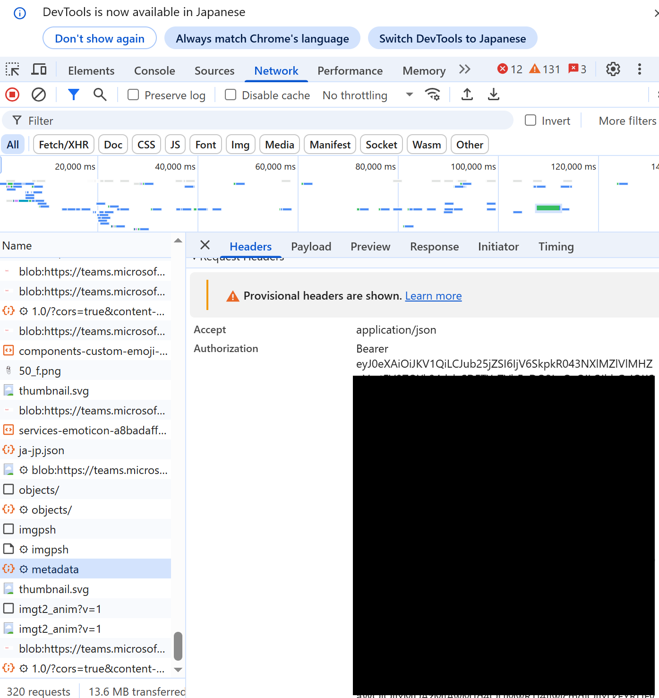
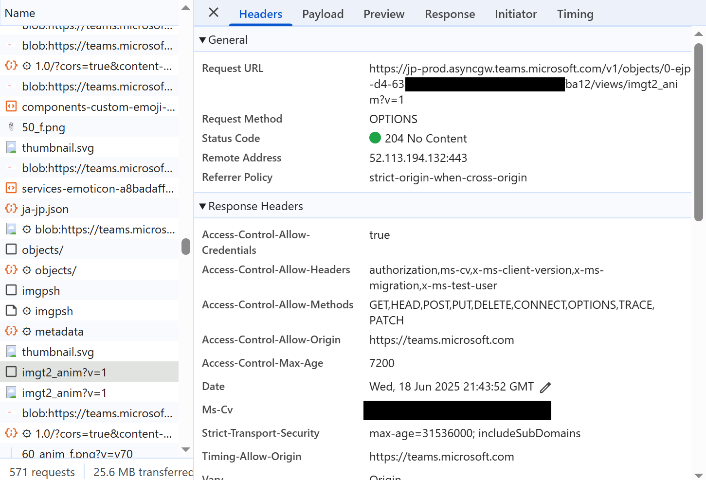
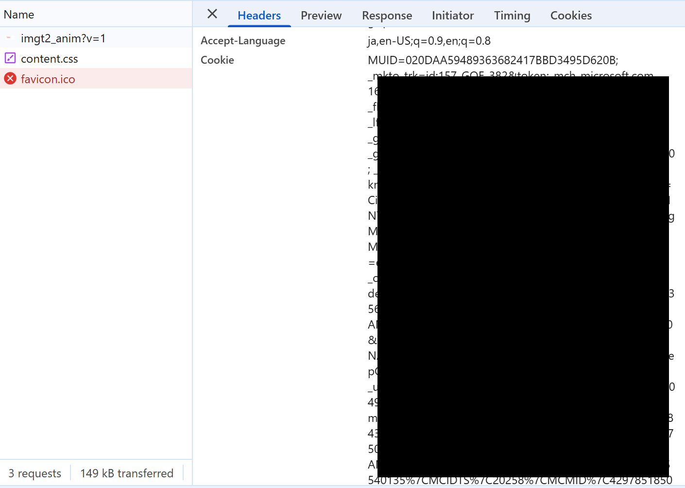

# カスタム絵文字リストエクスポート

このスクリプトは、Microsoft Teamsからカスタム絵文字リストをダウンロードするためのものです。

## 使用方法

1. Webブラウザ版Teamsを起動し適当なカスタム絵文字を追加すると https://teams.microsoft.com/api/csa/apac/api/v1/customemoji/metadata にアクセスしているのでその時のトークン(のちにTEAMS_ACCESS_TOKENにセット)を得ます。デベロッパーツール等で確認できる authorization フィールドのbearer以下の部分になります。以下の画像部分です。

   

2. 次に "https://jp-prod.asyncgw.teams.microsoft.com/v1/objects/0-ejp" が含まれるあて先に通信しているものを見つけ、どれでもよいのでカスタム絵文字が保存されているアドレスを得ます。その後、そのアドレスにアクセスします。以下の画像部分です。

   

3. カスタム絵文字が保存されているアドレスにアクセスしたら、そのアドレスへのアクセスではなく favicon.ico へのアクセスからCokkieを得ます。Cokkie フィールドの全量になります。以下の画像部分です。

   

4. 得たトークンとCokkieを環境変数を設定します：
   ```
   # Windows
   set TEAMS_ACCESS_TOKEN=your_access_token_here
   set TEAMS_COOKIE_TOKEN=your_cookie_token_here
   
   # Linux/Mac
   export TEAMS_ACCESS_TOKEN=your_access_token_here
   export TEAMS_COOKIE_TOKEN=your_cookie_token_here
   ```

5. スクリプトを実行します：
   ```
   python customemoji.py
   ```

6. 必要に応じて、customemoji.csv を Excel で開いたのち付属のVBAを実行すると画像一覧も読み込めます。

## 免責事項

このスクリプトは、個人的な使用のためのものです。